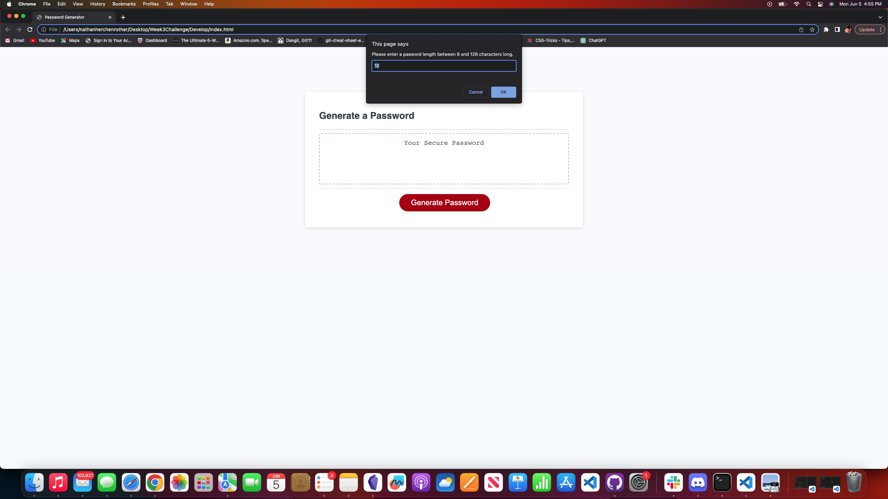
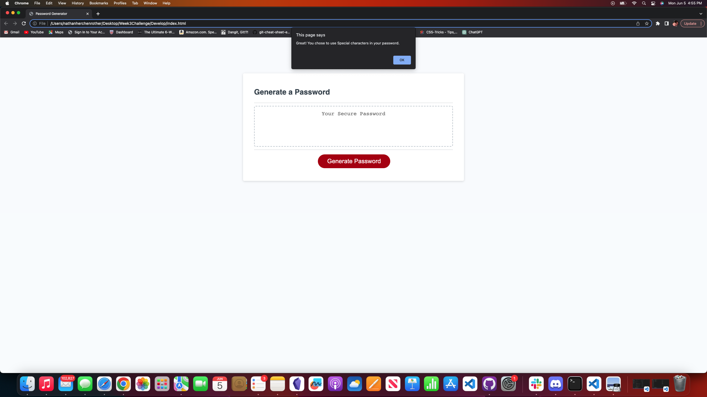
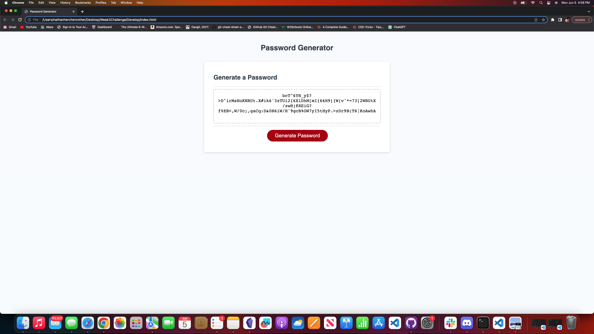
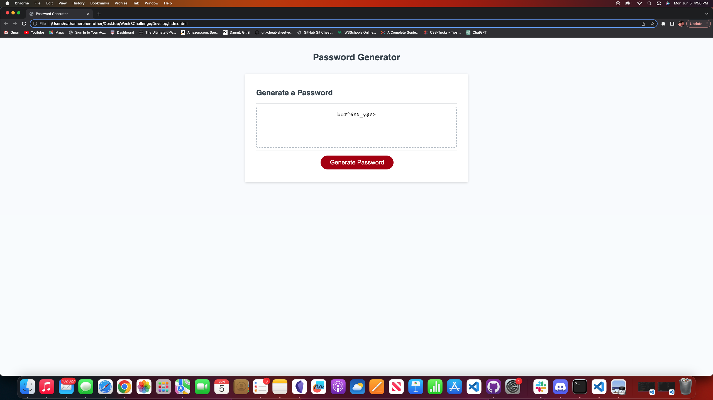

# <Your-Project-Title>

## Description

- The motivation behind this project was to write a code to create a password generator capable of randomly producing a password 8-128 characters with at least one of the following: Uppercase, Lowercase, Numerical, and Special characters.  It then posts the password to the text box on the page.  
- I built this project in order to satisfy the criteria given.  It allows a friendly user interface to produce a password that is secure in length and diversity to protect the users information.  The longer the length and more characters chosen allow for a more secure password.  
- This application solves the problem of having to come up with a complex password by yourself.  It randomly generates a password that can be added to someones list of passwords they use for different applications.  Password theft is a relative problem that this application allows an option for users to generate a password that is more secure.
- I learned different functions to create loops and using those to guide a users experience when entering information.  I learned about variables and how to use them to store and access information, as well as their usage in functions to solve problems and return new data.  Javascript is a great way to enhance an experience between the application and the user by taking information and helping them use that information to return a product or service to them.  

## Table of Contents (Optional)

- [Installation](#installation)
- [Usage](#usage)
- [License](#license)

## Installation

Open the browser and enter https://hershrva.github.io/RefiningPasswordGenerator/ in the address bar.

## Usage

The application works by opening the url (https://hershrva.github.io/RefiningPasswordGenerator/) in a browser then clicking on the "generate" button. (Screenshot #1)
The application then prompts the user to enter a password length between 8 and 128 characters. If the user enters anything outside of these
parameters it will loop them back to enter and new value for length. (Screenshot #2)
It then prompts the user to select 4 different sets of characters: Uppercase, Lowercase, Numberical and Special.  (Screenshot #3)
Each choice, including the password length, triggers an alert to let them know what they selected. If the user does not choose one of the
four selections of characters then they are looped back to the start of the four choices and asked to please select at least one.(Screenshot #4)
They are then presented with the password that fits the length and character choices that were selected (Screenshot #5 and #6)

## License

This project falls under the MIT license which can be found under the LICENSE file in the github repository.